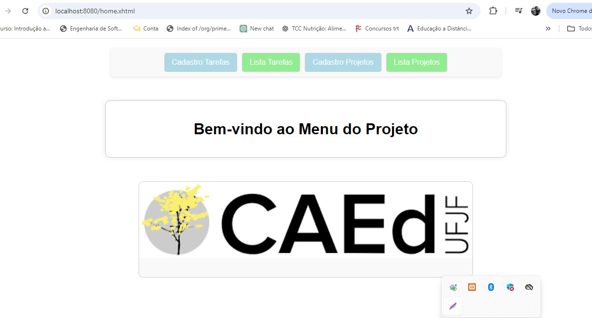
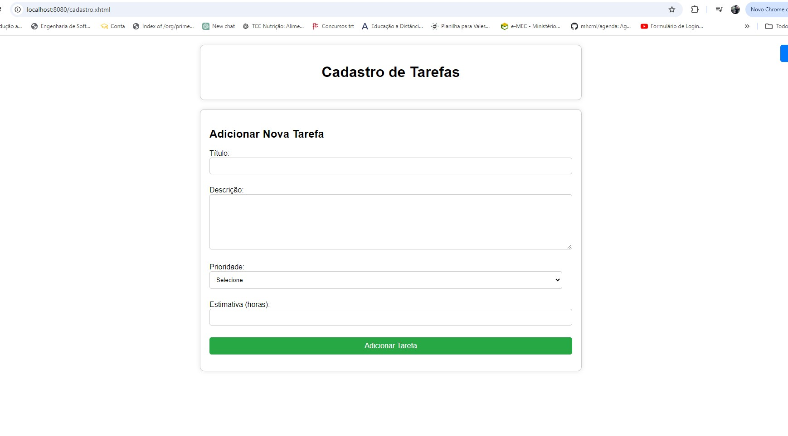
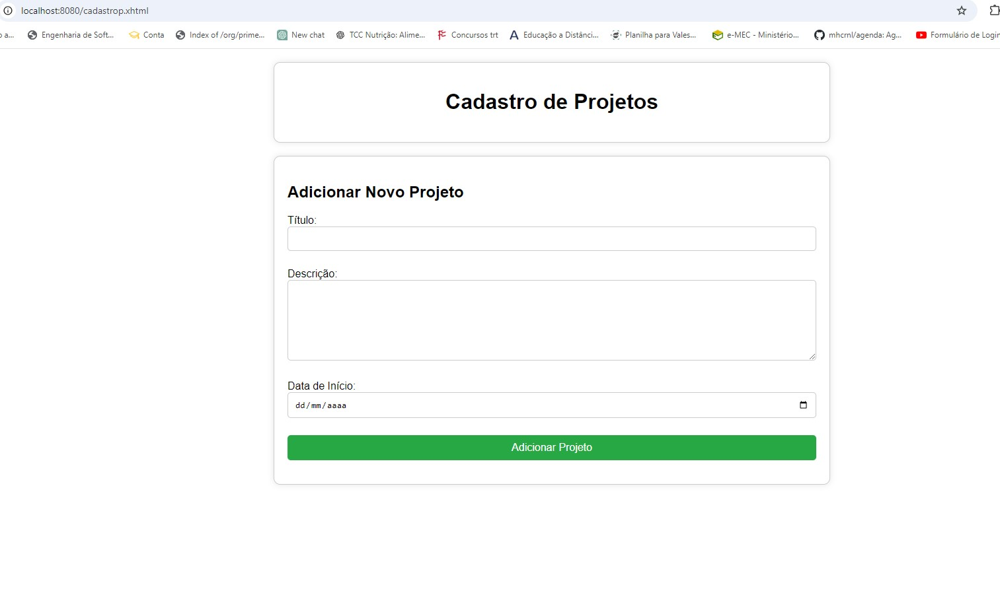
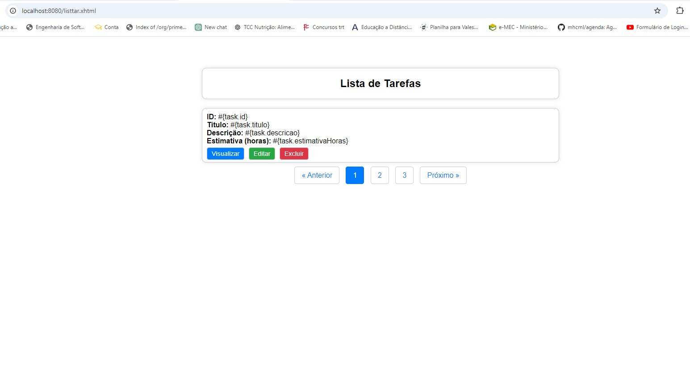
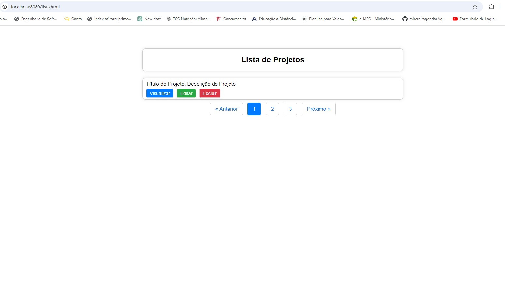
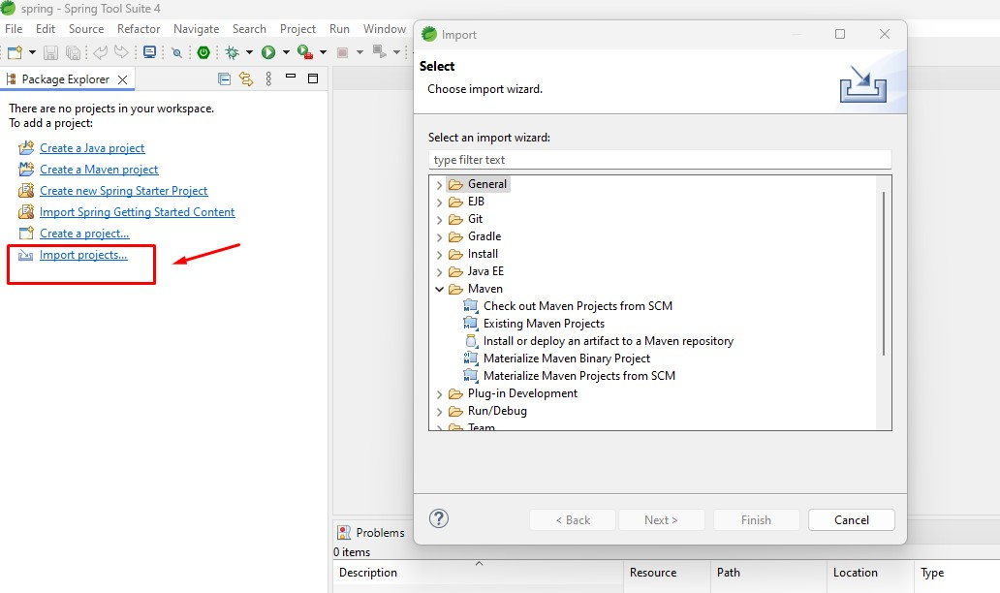
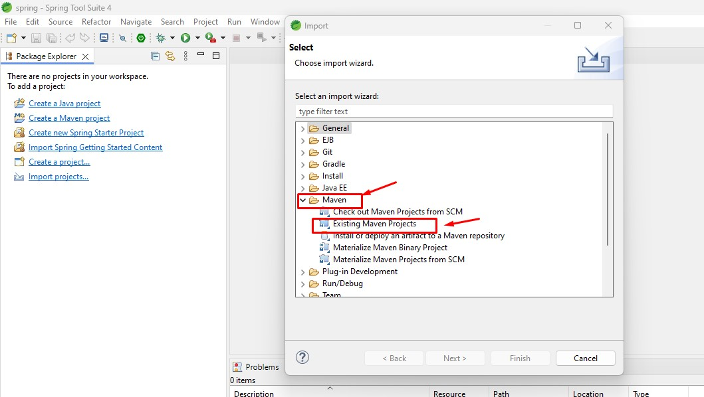
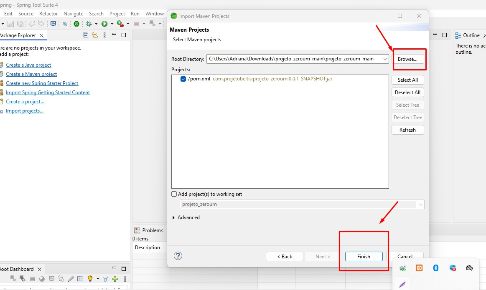
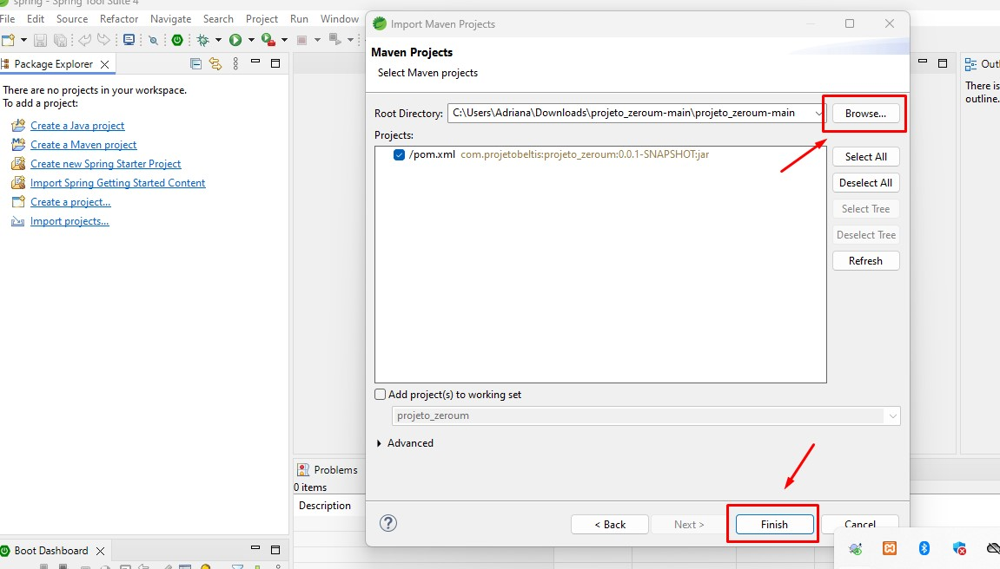

# Projeto de Avaliação CAED


<h4 align="center"> 
	🚧 Projeto de Avaliação CAED 🚧
</h4>

<p align="center">
	
	
</p>

<p align="center">
 <a href="#-sobre-o-projeto">Sobre</a> •
 <a href="#-funcionalidades">Funcionalidades</a> •
 <a href="#-layout">Layout</a> • 
 <a href="#-como-executar-o-projeto">Como executar</a> • 
 <a href="#-tecnologias">Tecnologias</a> • 
 <a href="#-contribuidores">Contribuidores</a> • 
 <a href="#-autor">Autor</a> • 
 <a href="#user-content--licença">Licença</a>
</p>


## 💻 Sobre o projeto

📄 Este projeto é uma aplicação de gerenciamento de tarefas e projetos, desenvolvida utilizando o Spring Framework do zero, com Hibernate para ORM, JUnit para testes, e XAMPP para o gerenciamento do banco de dados MySQL. A aplicação segue o padrão MVC (Model-View-Controller) e utiliza Maven para gerenciamento de dependências e build. O IDE utilizado para o desenvolvimento é o Spring Tool Suite (STS).


Projeto desenvolvido por: Anderson de Carvalho Fernandes [http://https://github.com/AndersonACF125]


---

## ⚙️ Funcionalidades

  - [x] Utilize o padrão de projeto MVC (Model-View-Controller) para estruturar a aplicação.
  - [x] Utilize RichFaces para aprimorar a interface do usuário com componentes ricos. (Não Utilizado, por ter sido descontinuado tanto pelo Maven quanto pelo Jboos). Utilizado Estilizaçção
  criada em css desenvolvido por mim. O projeto pode e está pronto com as dependências do PimeFaces caso queira utilizar.
  - [x] Spring para realizar a injeção de dependências nos beans gerenciados pelo JSF.
  - [x] Hibernate para mapear as entidades Projeto e Tarefa para o banco de dados, es- tabelecendo o relacionamento entre elas.
  - [x] Consultas HQL para as operações de adição, edição, remoção e listagem de projetos e tarefas.


---

## 🎨 Layout


### Web

<p align="center" style="display: flex; align-items: flex-start; justify-content: center;">
  

  

   

  


   
</p>

---

## 🛣️ Como executar o projeto

Este projeto é divido em Duas partes:
1. Backend (Desenvolvido em Java com Spring Frameworks) 
2. Frontend (Desenvolvido baseado em CSS)


💡O Frontend precisa que o Backend esteja sendo executado para funcionar.

### Pré-requisitos

Antes de começar, você vai precisar ter instalado em sua máquina as seguintes ferramentas:

Além disto é bom ter um editor para trabalhar com o código como [Spring Tool Suite (STS)](https://spring.io/tools)
este IDE foi escolhido para que seja menos moroso em subir a aplicação.
A aplicação podera ser rodada em outras IDEs, porem precisa Instalar o Tomcat 8, JDK 1.8, e Mavem. Além de configurar as variaveis dentro do Windows. (Feito teste com IDE Eclipse Mars2 e funcionou perfeitamente)

#### 🎲 Rodando o Backend (servidor)


# Faça o Download do repositório
https://github.com/AndersonACF125/projeto_zeroum

# Importe o projeto para o STS



# Escolha Maven e depois Existing Maven Projects e clique em Next



# Busque o diretorio onde salvou o projeto 



# Execute a aplicação (com o botão direito do mouse em cia do projeto importado, clique em Run as -> Spring Boot App)



# O servidor inciará na porta:8080 - acesse http://localhost:8080/home.xhtml

```


## 🛠 Tecnologias

As seguintes ferramentas foram usadas na construção do projeto:

- Spring Framework: Utilizado para a estruturação da aplicação e injeção manual de dependências. A aplicação foi construída do zero com Spring, sem utilizar Spring Boot.
- Hibernate: Utilizado para o mapeamento objeto-relacional (ORM) e acesso ao banco de dados.
- JUnit: Utilizado para a realização de testes unitários.
- XAMPP: Utilizado para o gerenciamento do banco de dados MySQL.
- Maven: Utilizado como gerenciador de build e dependências.
- MySQL: Banco de dados utilizado, criado de forma escalável para armazenar as informações de projetos e tarefas.
- Spring Tool Suite (STS): IDE utilizada para o desenvolvimento da aplicação.
- MVC (Model-View-Controller): Estrutura de design utilizada para separar as responsabilidades da aplicação.

---


## 🧙‍♂️ Autor

 <br />
 <sub><b>Anderson de Carvalho Fernandes</b></sub></a> <a href="https://github.com/AndersonACF125">✨</a>
 <br />

---

## 📝 Licença

<!-- Este projeto esta sobe a licença [MIT](./LICENSE). -->


